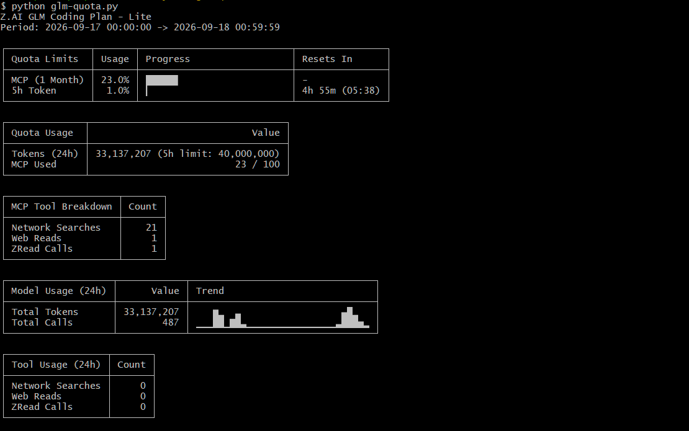

# glm-quota

A single-file Python CLI tool that shows your Z.AI GLM Coding Plan usage: quota limits, token consumption, MCP tool calls, 5h window reset time, and a 24h trend chart - printed directly to the console. No dependencies, no config files, just run it.



## Overview

`glm-quota.py` queries three Z.AI monitoring endpoints in parallel and renders a plain-text report:

- **Quota Limits**: 5-hour token window tokens and reset time, weekly token window, and monthly MCP quota with progress bars and reset countdowns
- **Quota Usage**: total tokens in the last 24h against the 5h token limit, and MCP calls used out of the monthly allowance
- **MCP Tool Breakdown**: network searches, web reads, ZRead calls
- **Model Usage (24h)**: total tokens, total calls, and a two-line trend sparkline of hourly token usage
- **Tool Usage (24h)**: per-tool call counts

It is a standalone Python port of the [opencode-glm-quota](https://github.com/guyinwonder168/opencode-glm-quota/). The motivation: checking quota through an agent session consumes tokens, which is exactly what you are out of when you need the check the most. This script talks to the monitoring API directly and uses zero tokens, so you can always check your quota status, even when you have none left. All rendering uses Unicode block characters that work in cmd, PowerShell, Git Bash, Linux, and macOS terminals (a pure ASCII mode is available via `--ascii`).

## Prerequisites

- **Python 3.7+** (uses `sys.stdout.reconfigure`); standard library only, nothing to `pip install`
- **Z.AI GLM Coding Plan subscription** (Lite and up)
- **API key**: set it as an environment variable  (needed only if the key isn't already in your global environment). The raw token is expected, with no `Bearer` prefix:

```bash
# bash / Git Bash
export ZAI_API_KEY="your-zai-api-key"

# PowerShell
$env:ZAI_API_KEY = "your-zai-api-key"

# cmd
set ZAI_API_KEY=your-zai-api-key
```

Keys are region-locked, so the endpoints follow the key you set:

| Region | Environment variables (checked in order) | Monitoring endpoints |
|---|---|---|
| International (Z.AI) | `ZAI_API_KEY`, `Z_AI_API_KEY` | `https://api.z.ai/api/monitor/usage/...` |
| China (Zhipu bigmodel.cn) | `ZHIPU_API_KEY`, `ZHIPUAI_API_KEY`, `BIGMODEL_API_KEY` | `https://open.bigmodel.cn/api/monitor/usage/...` |

If no key is set, the script prints an error to stderr and exits with code 1.

## Installation

The whole tool is one script. Clone the repo or download `glm-quota.py`:

```bash
git clone https://github.com/zeljkoavramovic/glm-quota.git
cd glm-quota
python glm-quota.py
```

There is nothing to install. Run the script with any Python 3.7+ interpreter.

## Usage

```bash
python glm-quota.py [flags]
```

With no flags, the full report (all five tables) is printed.

| Flag | Description |
|---|---|
| `--summary` | One-line 5h token window status, nothing else |
| `--limits` | Quota limits table only |
| `--usage` | Quota usage table only |
| `--mcp` | MCP tool breakdown table only |
| `--model` | Model usage table only |
| `--tools` | Tool usage table only |
| `--ascii` | Pure ASCII output: `#`/`-` progress bars and ASCII trend ladder |

Table flags can be combined; tables are printed in report order:

```bash
python glm-quota.py --summary
python glm-quota.py --model --ascii
python glm-quota.py --limits --usage
```

### Example: `--summary`

```
GLM 5h Token window at 18.0%, resets in 2h 28m (00:36)
```

This makes it easy to check your headroom from scripts, prompts, or status bars.

## How It Works

- **Endpoints**: three calls to `/api/monitor/usage/` (`quota/limit`, `model-usage`, `tool-usage`) at `https://api.z.ai` (international keys) or `https://open.bigmodel.cn` (CN keys), fetched concurrently with a 10-second timeout each
- **Auth**: the API key is sent as a raw `Authorization` header value
- **Window**: usage tables cover a rolling 24h window (yesterday at the current hour to today at the current minute), computed in local time
- **Parsing**: responses are parsed defensively, in the spirit of zod validation. Malformed fields demote or drop individual rows instead of crashing; partial endpoint failures degrade gracefully (only when every endpoint fails does the script exit with an error)
- **Token limit fallback**: if the API does not report the 5h window total, a default of 40,000,000 tokens is assumed

## Exit Codes

| Code | Meaning |
|---|---|
| `0` | Success |
| `1` | Python older than 3.7, no credentials in the environment, all endpoints failed, or no 5h window data in `--summary` mode |

## Support the project

If this tool has helped you, you can:

- ⭐ **Star the repository**
- 💬 **Share the repository**
- <a href="https://buymeacoffee.com/cupofavra" target="_blank">
     
   </a>

## License

MIT - use freely, improve openly, credit kindly.
